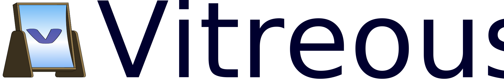

# 

Vitreous is a self-hostable URL shortener written in Crystal. 

For now, It is a toy project to improve author's skills with the language and its various libraries. **It is very early stage and is not supposed to work (yet). Please don't use it in production.** :warning:

## Roadmap

* :arrow_right: Setup base server
  * :arrow_right: Run HTTP service
  * :arrow_right: Authenticate user
* :arrow_right: Support persistent storage system
  * :arrow_right: use postgresql backend
  * :x: use redis backend
* :x: Managing URLs
  * :x: Create short URL
  * :x: Read short URL
  * :x: Delete short URL
  * :x: List short URLs
  * :x: Update short URLs
* :x: Support redirection
  * :x: handle created short url and redirect to original url
* :x: Support global configuration
  * :x: URL scheme setup (letters, numbers, etc.)
* :x: Add support for tracking
  * :x: track links click
  * :x: links per day (all time, last 30 days, last 14 days, last 7 days, last 24h, last hour)
  * :x: links per weekday
  * :x: links per hour
* :x: Add support for custom urls
  * :x: request a custom url (ok / not-ok)
  * :x: request a custom name (text is sanitized and the nearest available url is given)
* :x: Add frontend
  * :x: Support user authentication + JWT
  * :x: Support short URLs management actions (as user)
  * :x: Support short URLs customization actions (as user)
  * :x: Support system configuration (as admin)
  * :x: Copy short url to clipboard
  * :x: Generate QR code for URL

## Documentation

* [Installation](doc/installing.md)
* [Configuration](doc/configuration.md)
* [Contributing](doc/contributing.md)

## Authors & contributors

* [Glenn Y. Rolland](https://github.com/glenux) - creator and maintainer

## Sponsors

[Vitreous](https://github.com/glenux/vitreous) is an independent project whose development and maintenance is made possible thanks to the support of its patrons.

If you wish to join them and support the work of its author, just participate with this link:

**>>> [Become a patron or sponsor on Patreon](https://www.patreon.com/glenux) <<<**

## License

Vitreous is Copyright © 2020 Glenn ROLLAND. It is free software, and may be redistributed under the terms specified in the LICENSE.txt file.

## Alternatives and inspirations

* [Kutt.it](https://kutt.it/)
* [Golang-Url-Shortener](https://github.com/mxschmitt/golang-url-shortener)

